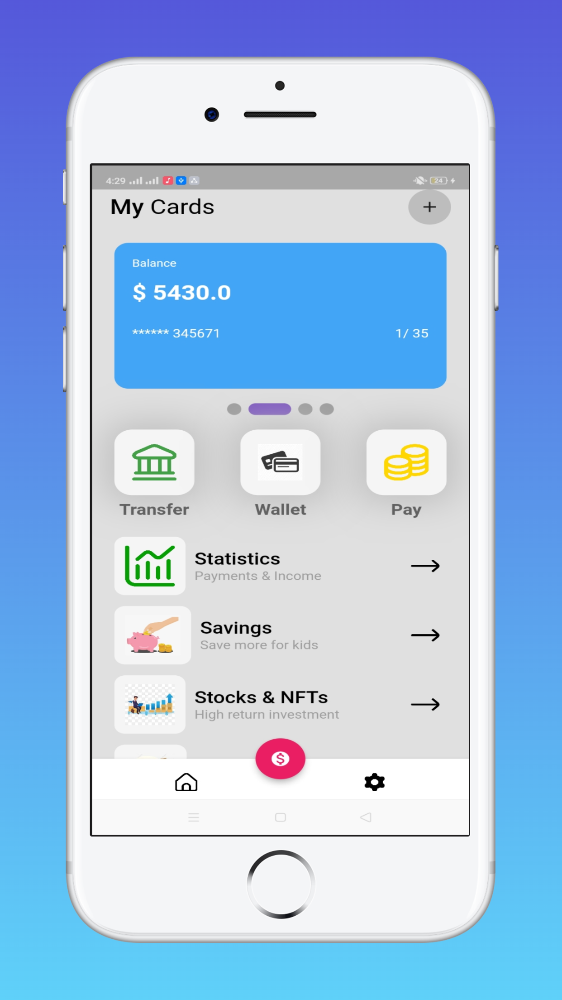
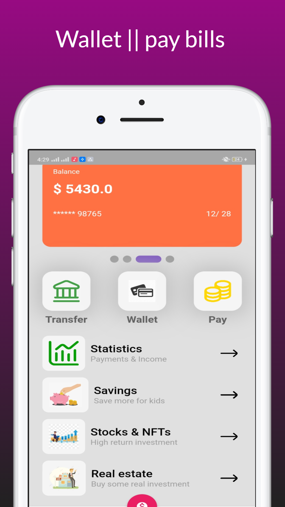
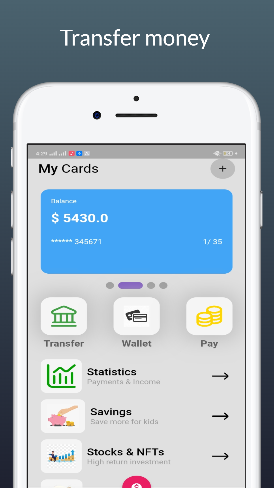
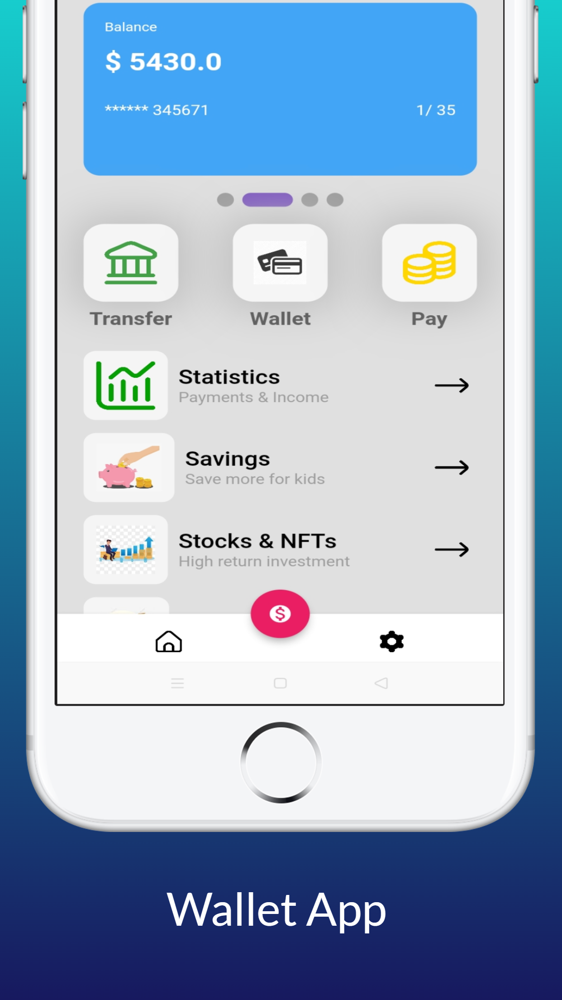

# Wallet App UI

Wallet app UI, 

#### Screenshots

<table>
  <tr>
    <td>Home Page</td>
    <td>Pay bills</td>
    <td>Payment</td>
  </tr>
  <tr>
    <td></td>
    <td></td>
    <td></td>
  </tr>
 </table>

<table>
  <tr>
    <td>Wallet app</td>
    <!-- <td>Home Page</td> -->
  </tr>
  <tr>
    <td></td>
    <!-- <td></td> -->
  </tr>
 </table>